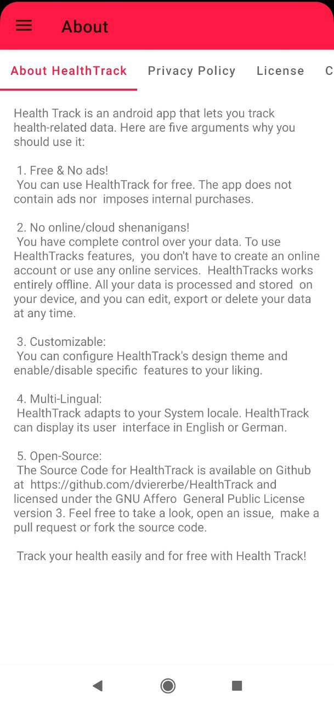
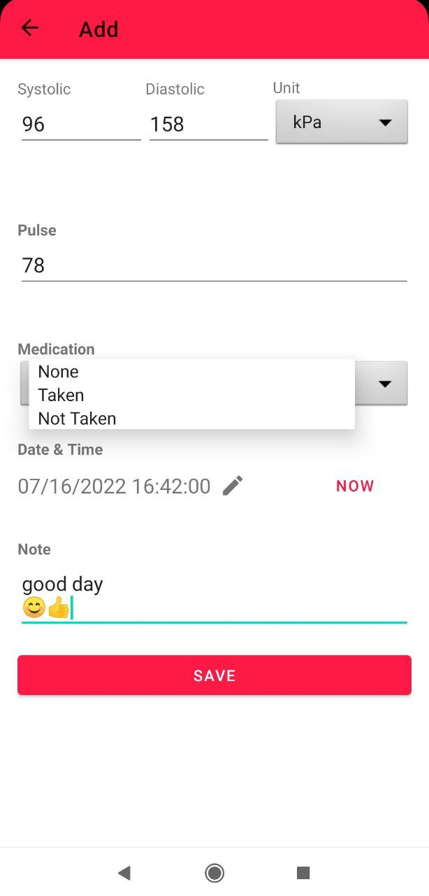
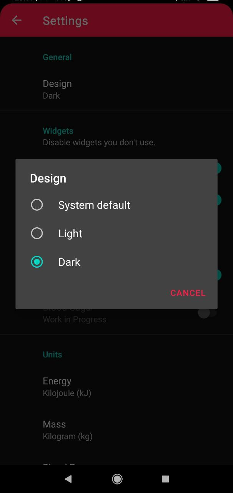
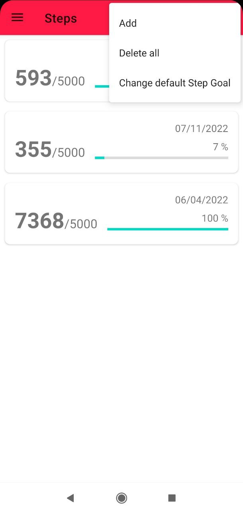
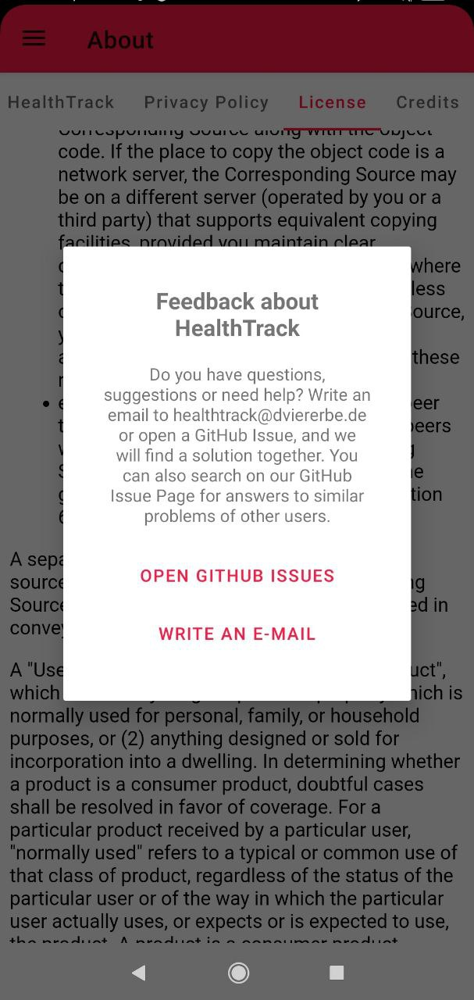
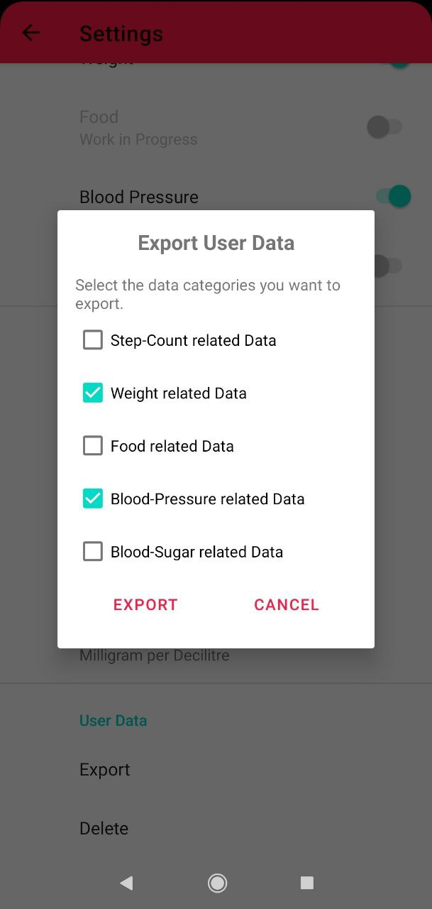

# Health Track

*Health Track* is an Android App that lets you track health related data.

## About

Health Track is an android app that lets you track health-related data.
Here are five arguments why you should use it:

1. Free &amp; No ads!
You can use HealthTrack for free. The app does not contain ads nor 
imposes internal purchases.

2. No online/cloud shenanigans!
You have complete control over your data. To use HealthTracks features, 
you don't have to create an online account or use any online services. 
HealthTracks works entirely offline. All your data is processed and stored 
on your device, and you can edit, export or delete your data at any time.

3. Customizable:
You can configure HealthTrack's design theme and enable/disable specific
features to your liking.

4. Multi-Lingual:
HealthTrack adapts to your System locale. HealthTrack can display its user 
interface in English or German.

5. Open-Source:
The Source Code for HealthTrack is available on Github at
https://github.com/dviererbe/HealthTrack and licensed under the GNU Affero
General Public License version 3. Feel free to take a look, open an issue,
make a pull request or fork the source code.

Track your health easily and for free with Health Track!

# Design Principles

- Clean Code  
- Clean Architechture
- MVVM ([Model View ViewModel](https://en.wikipedia.org/wiki/Model%E2%80%93view%E2%80%93viewmodel))

# Used Frameworks

- [Android View Binding](https://developer.android.com/topic/libraries/view-binding) (by Google)
- [Android Data Binding Library](https://developer.android.com/topic/libraries/data-binding/) (by Google)

## Screenshots

.jpg)

.jpg)    
.jpg)    
.jpg)    
.jpg)    
.jpg)    
.jpg)    
.jpg)    
.jpg)    
    
    
    
    
    
    
    
    

## License

Health Track    
Copyright (C) 2022 Dominik Viererbe

This program is free software: you can redistribute it and/or modify it under the terms of the GNU Affero General Public License as published by the Free Software Foundation, either version 3 of the License, or *(at your option)* any later version.

This program is distributed in the hope that it will be useful, but WITHOUT ANY WARRANTY; without even the implied warranty of MERCHANTABILITY or FITNESS FOR A PARTICULAR PURPOSE. See the GNU Affero General Public License for more details.

You should have received a copy of the GNU Affero General Public License along with this program. If not, see <<https://www.gnu.org/licenses/>>.
