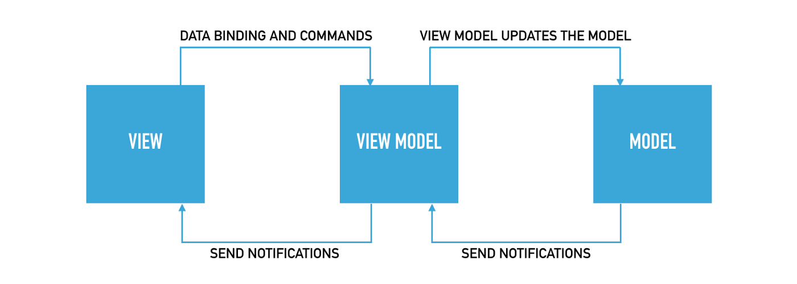

[](https://www.gnu.org/licenses/gpl-3.0-standalone.html)

# Health Track

*Health Track* is an Android App that lets you track health related data.

It was developed as an exam submission.

## About

Health Track is an android app that lets you track health-related data.
Here are five arguments why you should use it:

1. Free &amp; No ads!
You can use HealthTrack for free. The app does not contain ads nor 
imposes internal purchases.

2. No online/cloud shenanigans!
You have complete control over your data. To use HealthTracks features, 
you don't have to create an online account or use any online services. 
HealthTracks works entirely offline. All your data is processed and stored 
on your device, and you can edit, export or delete your data at any time.

3. Customizable:
You can configure HealthTrack's design theme and enable/disable specific
features to your liking.

4. Multi-Lingual:
HealthTrack adapts to your System locale. HealthTrack can display its user 
interface in English or German.

5. Open-Source:
The Source Code for HealthTrack is available on Github at
https://github.com/dviererbe/HealthTrack and licensed under the GNU Affero
General Public License version 3. Feel free to take a look, open an issue,
make a pull request or fork the source code.

Track your health easily and for free with Health Track!

[Look at some screenshots.](SCREENSHOTS.md)

## API Reference

The Javadoc API reference can be found in the `api-reference` folder.

## Design Principles & Architecture

Note: The project contains some anti-patterns that are in violation to the 
following design principles. These anti-patterns emerged, because not enough time for refactoring was left. 
The developer is aware of these problems. It is strongly recommended to refactor these violations, before any
additional features are implemented. The cost refactoring and adding features will strictly rise if this 
recommendation is not taken seriously. 

An example for such a violation is the `de.dviererbe.healthtrack.presentation.main.home.HomeViewModel` class.
It violates the [Open–Closed principle](https://en.wikipedia.org/wiki/Open%E2%80%93closed_principle) in that
each `...ListItemViewModel` has to be created within the Class manually. When the 
`BloodSugarListItemViewModel` or `FoodListItemViewModel` classes will be added in the
future the class has to be changed to adapt to this change.

A much better solution that does not violate the [Open–Closed principle](https://en.wikipedia.org/wiki/Open%E2%80%93closed_principle) 
and would reduce future efforts when additional widgets could be added would be
an abstraction that would allow to iterate about all repositories and create a
`...ListItemViewModel` from it.

### Clean Code

Clean code is a term that originated in Robert C. Martin's book of the same name. It primarily refers to intuitively 
understandable source code, but also documents, concepts, rules, and procedures can be meant. Anything that can be 
adequately understood with little effort and in a short time is considered intuitively understandable. The advantages 
of clean code are more stable and efficiently maintainable programs, i.e. shorter development times for function 
extensions and bug fixes.

#### SOLID Principles

SOLID is an acronym for five design principles intended to make object-oriented designs more understandable, flexible, 
and maintainable. The principles are a subset of many principles promoted by Robert C. Martin and are used frequently 
in this project.

##### 1. Single Responsibility Principle
States that every package, class or function should have responsibility over a single part of a program's functionality, 
and it should encapsulate that part. 

> *"A class should have only one reason to change"* 
> Martin, Robert C. (2003). Agile Software Development, Principles, Patterns, and Practices.

Applying the Single Responsibility Principle has the advantage that packages, classes and functions tend to be 
smaller and less complex, reducing the likelihood of creating bugs, the time to find bugs and the time needed to 
introduce new features.

##### 2. Open–Closed Principle

States that packages, classes, and functions, should be open for extension but closed for modification, which 
allows extending their behaviour without modifying its implementation.

Designing packages, classes, and functions with the Open–Closed Principle in mind will reduce the likelihood of 
introducing bugs in already existing implementations because they do not have to be changed when new features are 
introduced.
Every change introduces the probability of creating a Bug; therefore, an implementation that is changed less 
frequently can build a track record of trust over time the longer no bug is reported.

##### 3. Liskov Substitution

Based on the concept of "substitutability" and states that an object (e.g., a class) and a sub-object 
(e.g., a class that extends the first class) must be interchangeable without breaking the program.

The liskov substitution principle has a less visible but significant role in this project because of 
the many architectural abstractions that exist.
Every user of an interface or abstract class implementation expects a specific behaviour. 
If an implementation violates the expected behaviour, the application can crash.

##### 4. Interface Segregation Principle

States that no code should depend on functions it does not use; therefore, large interfaces should be split 
into smaller and more specific ones so that clients will only have to know about them.

Relying on commonly used broad abstractions can introduce tight coupling, which can obstruct the ability to 
make a change in one place without necessitating many additional changes.
Using an interface or an abstract class can prevent this side effect.

##### 5. Dependency Inversion Principle

It is a methodology for loosely coupling software and states that:
  1. High-level modules should not import anything from low-level modules. Both should depend on abstractions (e.g., interfaces).
  2. Abstractions should not depend on details.

As the basis for the Clean Architecture principle, it is probably the most frequently used principle in this project and can be seen in the module "abstractions".

The importance and benefits of the dependency inversion principle are discussed more in the following paragraph "Clean Architecture".

### Clean Architecture


Clean Architecture is a term that originated in Robert C. Martin's book of the same name. 
He describes a layered architecture that is loosely coupled using the Dependency Inversion Principle 
and is derived from many architectural guidelines like Hexagonal Architecture, Onion Architecture, etc. 
The core layers are implemented entirely independent of platform-specific drivers, infrastructure or frameworks, 
which can only be indirectly accessed through the interfaces of the layer.

The use of Clean Architecture results in highly testable, maintainable, changeable and independent code.

### MVVM ([Model View ViewModel](https://en.wikipedia.org/wiki/Model%E2%80%93view%E2%80%93viewmodel))

MVVM is a 3-layer event-driven architectural pattern that separates the logic of persisting data (Model), presenting data (View) and processing the presentation and persistence events (ViewModel).


(Source: https://medium.com/@rajithaperera_81165/how-to-create-an-android-project-with-the-mvvm-architectural-pattern-part-1-ac7029653056)

The Model is responsible for reading/writing data from/to the storage solution and notifying the ViewModel when changes occur.

The View is responsible for displaying data and informing the ViewModel when the User interacts with the UI. It does not contain any application 
logic.

The ViewModel is a converter that links between the Model and View.
It exposes the View to the relevant data of the Model (converted if needed) and performs the necessary Model interactions based on the user interaction events from the View.

Separating the three concerns comes with the advantage that every layer can be changed independently and tend to be less complex because each layer serves only one purpose and is, therefore, better maintainable. The separation makes the application logic which is embedded in the view model, also easily testable.

During this documentation process, the developer noticed that the implementations of the MVVM pattern in this project are slightly violating the separation between the View and ViewModel. The ViewModels hold a reference to an interface that is implemented by the Views. Because of the described violation, the ViewModel implementations implement the MVP (Model View Presenter) pattern as the role of the Presenter. It is strongly recommended to refactor the violations to the intended observer pattern. 

### Repository Pattern

This Project uses the Repository Pattern to abstract storage solutions. The abstraction enables the testability of components that depend on the storage mechanisms because the Repository interface can be [mocked](https://en.wikipedia.org/wiki/Mock_object) in automated tests. The abstraction also allows the implementation to be swapped without changing the implementation of the dependent components.

Repository Interfaces are used as the Models in the MVVM pattern.

## Implementation Details

### View Binding & Data Binding

The Android [View Binding](https://developer.android.com/topic/libraries/view-binding) and [Data Binding](https://developer.android.com/topic/libraries/data-binding/) Libraries by Google are used to bind a ViewModel to a View (implemented by Android Fragment and Layout).

[View Binding](https://developer.android.com/topic/libraries/view-binding) generates the layout inflation and view component retrieval and casting.

Data Binding allows interacting with the View Model in the XML definition of a layout. The Data Binding Library generates the implementation that calls the view model functions on initialization and user interaction.

Here is an example of the WeightDetails Fragment that allows to inflate the layout and bind the ViewModel to it in two lines:

```
_binding = FragmentWeightDetailsBinding.inflate(inflater, container, false);
_binding.setViewModel(_viewModel);
```

Using [View Binding](https://developer.android.com/topic/libraries/view-binding) and [Data Binding](https://developer.android.com/topic/libraries/data-binding/) reduces the development time and enables static analysis at compile time. Static analysis eliminates layout/view id mismatch and resulting runtime exceptions.

It is recommended to refactor the existing Views further to use [two-way data-binding](https://developer.android.com/topic/libraries/data-binding/two-way). This can potentially reduce redundant implementations that can be dominantly found in the merge Views.

### SQLite

A local SQLite Database is used to implement the repository interfaces of the widgets. SQLite was chosen because the SQL language variant is well known to the developer, and it is widely used in the Android Community and therefore has many tutorials, guides and forum entries that help implement and troubleshoot it. 

The relational database engine and the SQL language variant allow the storage of complex data structures with ease. Although no complex data structures are stored in this project, it is still easier to use than implementing and testing a low-level custom storage solution. It simultaneously opens possibilities for future features.

### Recycler View

The list-Views have the task of displaying a list with an unknown number of items. Using a [RecyclerView component](https://developer.android.com/jetpack/androidx/releases/recyclerview) reduces the number of items that have to be loaded in memory simultaneously.
The [RecyclerView component](https://developer.android.com/jetpack/androidx/releases/recyclerview) reuses items that are scrolled out of the viewport (https://en.wikipedia.org/wiki/Viewport) by the user.

## State of automated Tests

Many paragraphs mention testability as one usage reason for specific patterns/styles. However, neither Unit Tests, Integration Tests, nor End-to-End Tests are part of this project.

The developer is aware of this problem and recommends resolving this issue before adding any more features. Automated tests are essential to ensure product quality and catch regression early on while developing new features.
This Application was developed as an exam submission and never intended to be used in the real world. If this assumption ever changes, a [Test Driven Development](https://en.wikipedia.org/wiki/Test-driven_development) approach should be taken.

## License

Health Track    
Copyright (C) 2022 Dominik Viererbe

This program is free software: you can redistribute it and/or modify it under the terms of the GNU Affero General Public License as published by the Free Software Foundation, either version 3 of the License, or *(at your option)* any later version.

This program is distributed in the hope that it will be useful, but WITHOUT ANY WARRANTY; without even the implied warranty of MERCHANTABILITY or FITNESS FOR A PARTICULAR PURPOSE. See the GNU Affero General Public License for more details.

You should have received a copy of the GNU Affero General Public License along with this program. If not, see <<https://www.gnu.org/licenses/>>.
