# Screenshots

## Home

List of all to days taken measurements.    
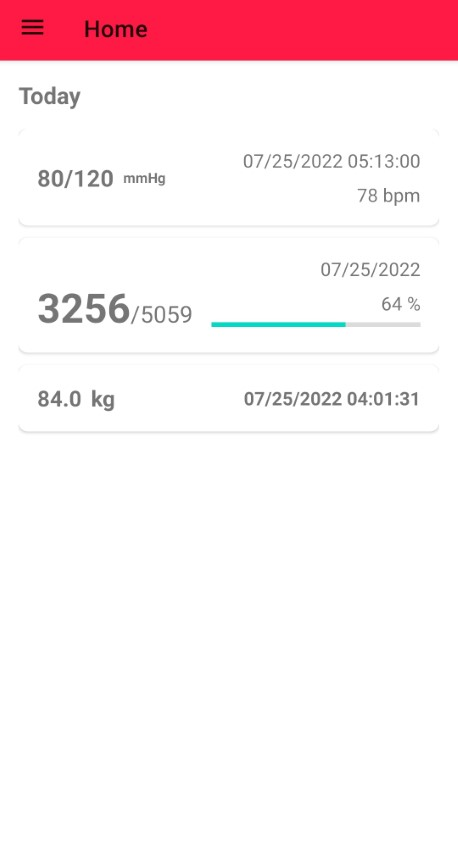

App-drawer to navigate to other widgets, settings, etc.    
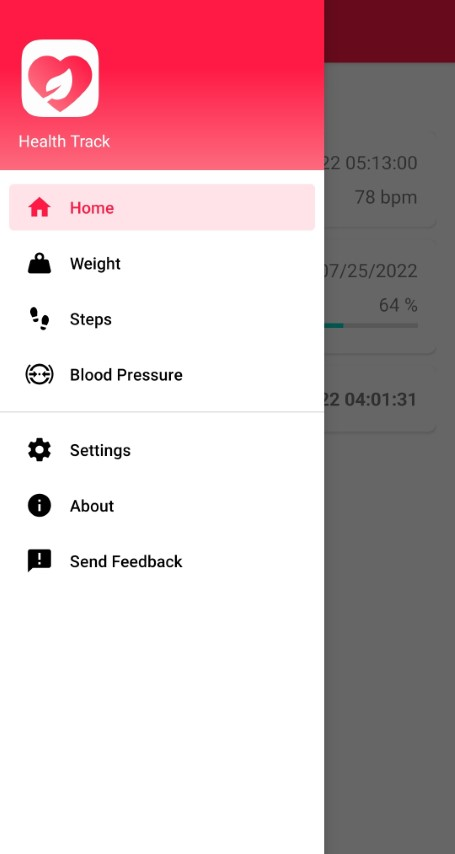

## Blood Pressure Widget

The blood pressure widget allows to track blood pressure related data like systolic/diastolic blood pressure, pulse, etc.

### List

The list view shows all blood pressure measurements in descending order by time of measurement.
Clicking on an element shows the details of it.    
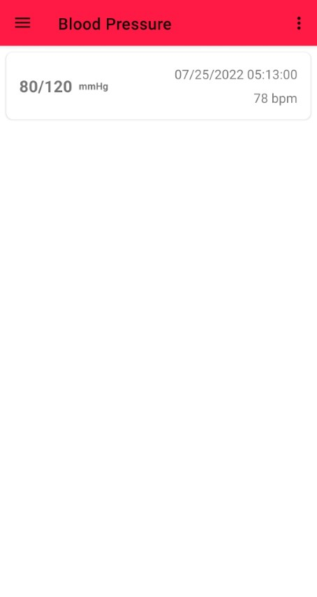

### Record Details

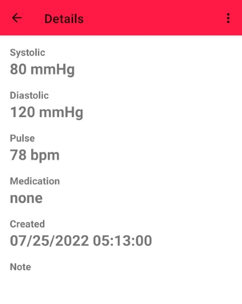

### Create/Update Record

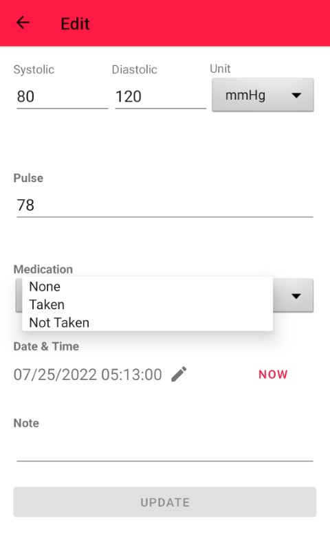

## Step Count Widget

The step count widget allows to track the daily step count and to set goals for it.

In contrast to the other widgets, only one measurement per day can be made here; otherwise it would not make sense.

### List

The list view shows all step count measurements in descending order by time of measurement.
Clicking on an element shows the details of it.

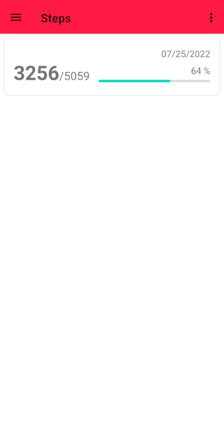

### Record Details

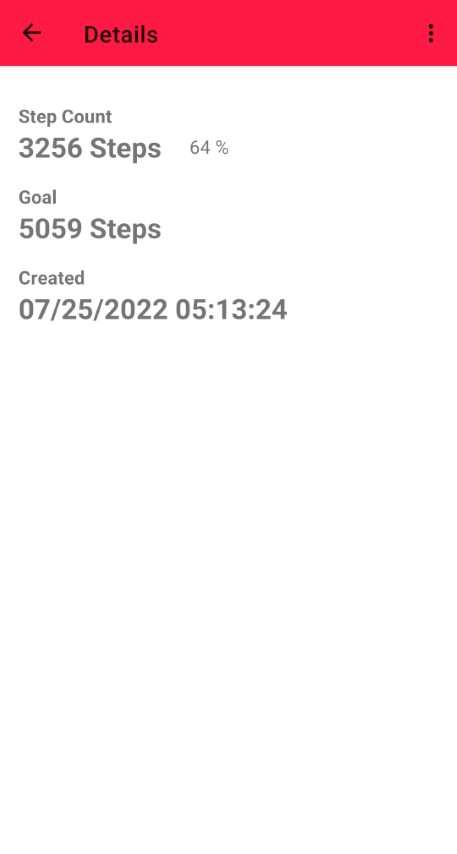

### Create/Update Record

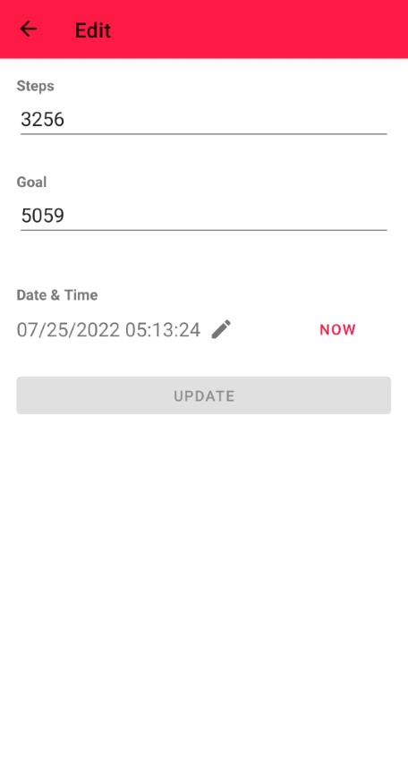

### Update Default Step Count Goal

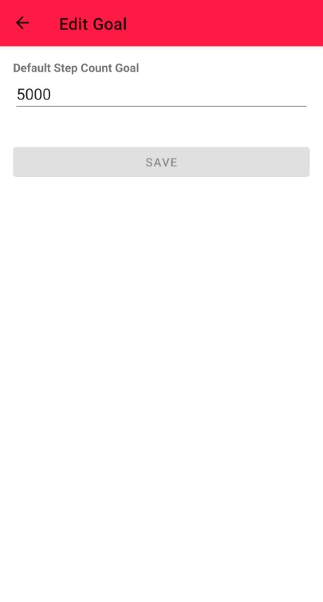

## Weight Widget

The weight widget allows to track the body weight.

### List

The list view shows all body weight measurements in descending order by time of measurement.
Clicking on an element shows the details of it.

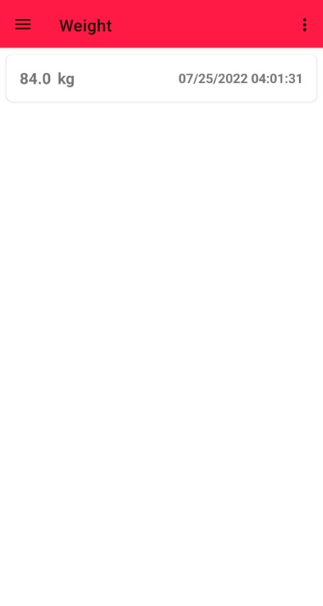

### Record Details

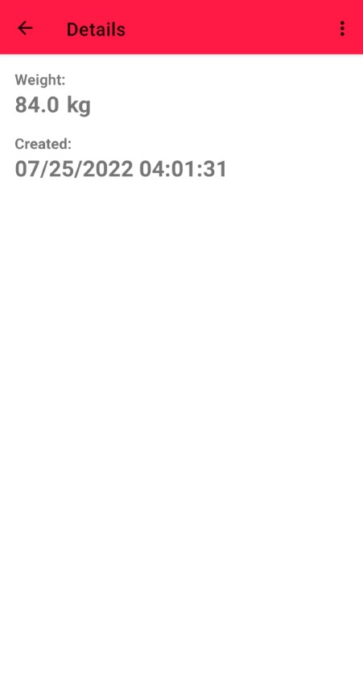

### Create/Update Record

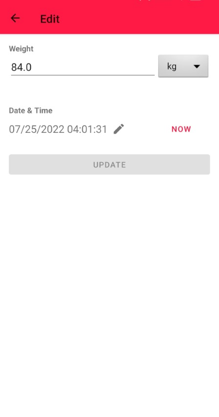

## About

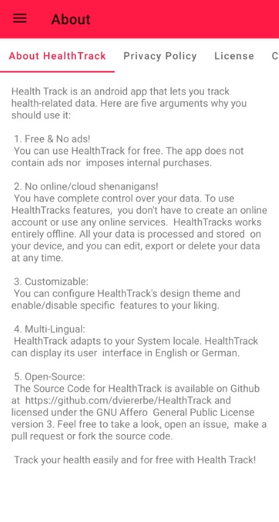
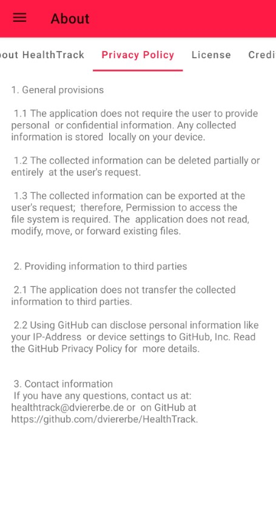
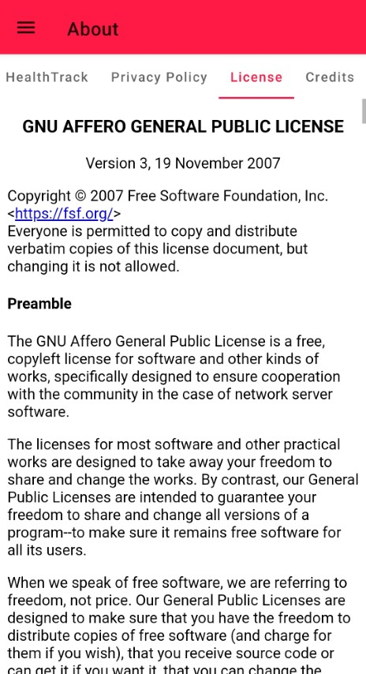

## Settings

The App has a light and a dark UI Theme and can adapt to the System Settings:    

Widgets can be disabled/enabled to be displayed in the UI individually.  

The preferred Units can be changed which results in an auto conversion of values which are not measured in the preferred unit.    

The collected User Data can be exported as [RFC 8259](https://www.rfc-editor.org/rfc/rfc8259.html) and [ECMA-404](http://www.ecma-international.org/publications/standards/Ecma-404.htm) compatible JSON text.    

The collected User Data can also be deleted from the device.

Screenshot of all Settings:    
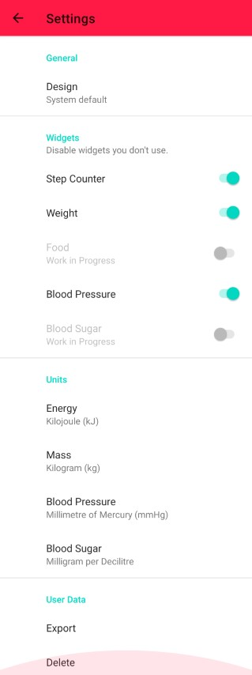